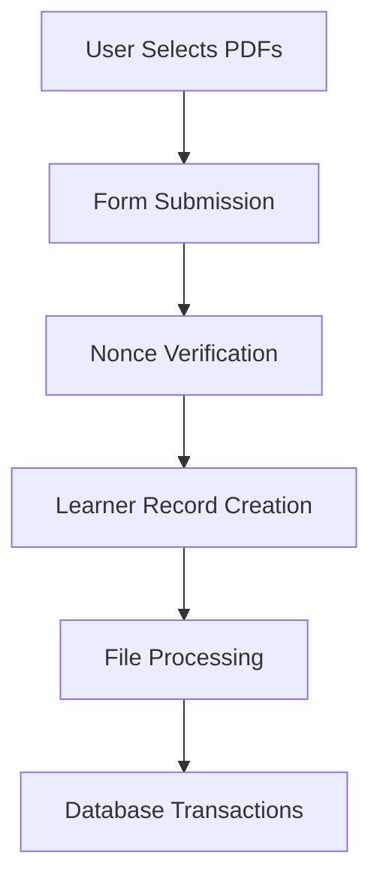

# Portfolio Upload Functionality Analysis

**Date:** 25/01/2025  
**Last Updated:** 25/01/2025 20:15 (UTC+2)  
**Related Files:**  
- `learners-capture-shortcode.php`  
- `learners-db.php`

## Core Implementation Details

### 1. File Upload Workflow


### 2. Security Features
- **Validation Layers:**
  - Client-side: `accept="application/pdf"` attribute
  - Server-side: MIME type checking
  - WordPress nonce verification
  - Input sanitization (`sanitize_text_field`, `sanitize_email`)

- **File Handling:**
  - Unique filename generation with `uniqid()`
  - Restricted upload directory permissions
  - Separation of file metadata (DB) and binary storage

### 3. Database Schema Impact
```sql
-- learner_portfolios table structure
CREATE TABLE learner_portfolios (
    portfolio_id SERIAL PRIMARY KEY,
    learner_id INT REFERENCES learners(id),
    file_path VARCHAR(255),
    upload_date TIMESTAMP DEFAULT CURRENT_TIMESTAMP
);
```

### 4. Error Handling Matrix
| Error Type              | User Feedback                     | Logging Location      |
|-------------------------|-----------------------------------|-----------------------|
| File Type Mismatch      | Bootstrap alert - danger         | debug.log             |
| DB Insert Failure       | Transaction rollback message     | PHP error_log         |
| File Move Error         | Partial success notification     | System error logs     |
| Size Limit Exceeded     | Client-side form validation       | Browser console       |

## Recommended Improvements
1. Add file size validation (server-side)
2. Implement virus scanning hook
3. Add file versioning system
4. Create PDF content validation check
